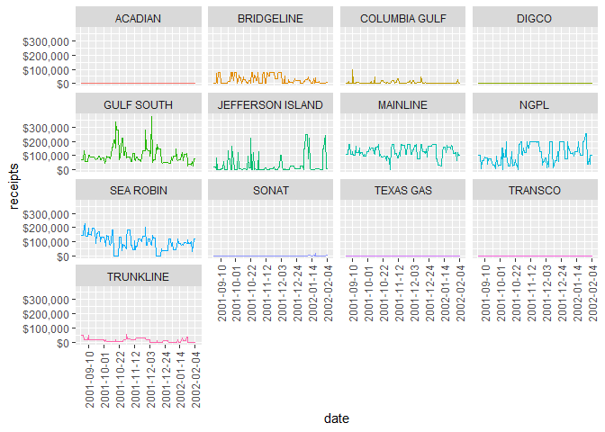

<!-- README.md is generated from README.Rmd. Please edit that file -->

# str.rdev

<!-- badges: start -->

[](https://github.com/StreamlineDataScience/str.rdev/actions/workflows/R-CMD-check.yaml)
<!-- badges: end -->

The goal of `str.rdev` is to download and process the Enron data set.

## Installation

You can install the development version of `str.rdev` from
[GitHub](https://github.com/) with:

``` r
# install.packages("remotes")
remotes::install_github("StreamlineDataScience/str.rdev")
```

## Caveats

Parsing of the spreadsheet is very fragile.

- I give exact locations for the start corner and end corner for each
  block of data. It would be preferable to detect blocks of data by
  their properties.
- I also explicitly drop the expected blank row after the date for each
  block, but should ideally auto-detect blank rows and drop them.
- I assume every location will have both a receipts entry and a
  deliveries entry in each segment. As of this spreadsheet that is
  always true, but there’s no hard rule that requires that to be so.

I’ve included TODO items in the code to make it easier to find these
items using the {todor} package.

## Shiny App: Insights and Improvements

``` r
library(str.rdev)
dat <- system.file("extdata/enron.xls", package = "str.rdev") |>
    enron_process_data()
ggplot2::ggplot(
            dat,
            ggplot2::aes(x = date, y = receipts, color = location)
        ) +
            ggplot2::geom_line() +
            ggplot2::scale_x_date(
              date_labels = "%Y-%m-%d",
              date_breaks = "3 weeks"
            ) +
            ggplot2::scale_y_continuous(labels = scales::dollar_format()) +
            ggplot2::facet_wrap(ggplot2::vars(location)) +
            ggplot2::theme(
              axis.text.x = ggplot2::element_text(
                angle = 90, vjust = 0.5, hjust = 1
              ),
              legend.position = "none"
            )
```



A number of things stand out for further investigation:

- ACADIAN, DIGCO, TEXAS GAS, and TRANSCO appear to have 0 receipts for
  all dates, and SONAT only has a few. That could indicate an issue with
  the data, if not the site.
- There doesn’t appear to be a strong correlation between the sites. I
  expected there might be a seasonal effect, but that does not appear to
  be so.
- Since this is Shiny, there should be interaction! The lowest hanging
  fruit would be a drop-down menu of the sites, so that each plot could
  be larger.
- Expanding that to checkboxes to display/remove each site, and a
  setting to facet or stack the plots would also allow for further
  interactive investigation.
- It would be helpful to make the plots interactive, showing the date
  and amount for each point on hover.
- If the data were real, we would likely want to forecast both receipts
  and deliveries, and otherwise dig deeper into the data.
